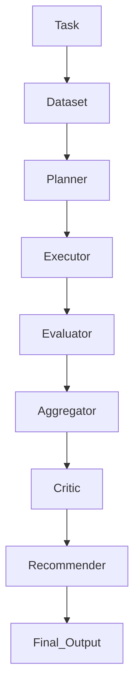

# Multimodal Evaluation Engine

This is a benchmarking platform built to evaluate AI pipelines across text, images (OCR), and speech (ASR). It uses a modular agent-based system to handle different tasks and providers, making it easier to compare performance, latency, and cost in a standardized way.

---

## Overview

Selecting the right AI provider for a specific task can be difficult. This engine provides a framework to compare models like Gemini, Groq, and local Ollama instances using more than just basic accuracy. It integrates semantic similarity, character-level matching, and normalized cost/latency metrics to give a clear picture of which pipeline actually works best for your needs.

### Key Capabilities
- **Task Agnostic**: Designed to handle summarization, question answering, OCR extraction, and ASR transcription without major configuration changes.
- **Agent Orchestration**: Uses LangGraph to manage a structured workflow—moving from planning and execution to evaluation and final recommendation.
- **Flexible Evaluation**: Can evaluate raw model outputs or ingest scores directly from specialized benchmark services.
- **Comprehensive Scoring**: Aggregates accuracy, speed, and cost while accounting for failures to ensure reliable recommendations.

---

## Architecture

The engine follows a logical workflow to ensure every sample is handled consistently:



1.  **Planner**: Determines which pipelines to run based on the task and whether you're in benchmark or production mode.
2.  **Executor**: Runs the selected pipelines in parallel.
3.  **Evaluator**: Scores the results using task-specific metrics (like semantic similarity for summaries).
4.  **Aggregator**: Combines results, normalizes metrics, and applies penalties for any failures.
5.  **Critic**: Provides a written analysis of each pipeline's performance.
6.  **Recommender**: Selects the best performing pipeline based on the final data.

---

## Getting Started

### 1. Prerequisites
- Python 3.10 or higher
- [Ollama](https://ollama.ai/) for local model testing
- Tesseract OCR (if running OCR tasks)

### 2. Installation
```bash
# Clone the repository
git clone https://github.com/DurvankGade/multimodal-eval-engine.git
cd multimodal-eval-engine

# Set up a virtual environment
python -m venv venv
source venv/bin/activate  # On Windows use: venv\Scripts\activate

# Install dependencies
pip install -r requirements.txt
```

### 3. Environment Variables
Create a `.env` file in the root directory to store your API keys:
```env
GEMINI_API_KEY=your_gemini_key
GROQ_API_KEY=your_groq_key
```

---

## Usage

### CLI Interface
You can run a benchmark from the terminal by specifying the task, mode, and dataset:
```bash
python main.py --task summarization --mode benchmark --dataset text_prod
```

**Available Arguments:**
- `--task`: `summarization`, `question_answering`, `ocr_extraction`, or `speech_transcription`
- `--mode`: `benchmark` (API comparison) or `production` (includes local models)
- `--dataset`: `text_prod`, `ocr_prod`, or `asr_prod`

### Web Dashboard
If you prefer a visual interface, you can launch the Streamlit dashboard:
```bash
streamlit run app.py
```

---

## Metric System

The final score is calculated using a formula that balances performance across several dimensions:
$$Score = (Acc \times w_{acc}) - (Lat_{norm} \times w_{lat}) - (Cost_{norm} \times w_{cost}) - (Fails \times penalty)$$

- **Accuracy**: Uses semantic similarity for text or Levenshtein distance for extraction tasks.
- **Latency**: Normalized against a threshold (default is 5 seconds).
- **Failure Penalty**: Systematic failures are heavily penalized to favor reliable pipelines.

---

## Project Structure
```text
├── engine/             # Core orchestration logic
├── pipelines/          # Integrations for different providers
├── evaluators/         # Metric implementations
├── utils/              # Helper functions and logging
├── configs/            # Scoring weights and thresholds
├── logs/               # JSON results and summaries
└── app.py              # Streamlit dashboard
```

---

## License
MIT License. Developed by [Durvank Gade](https://github.com/DurvankGade).
